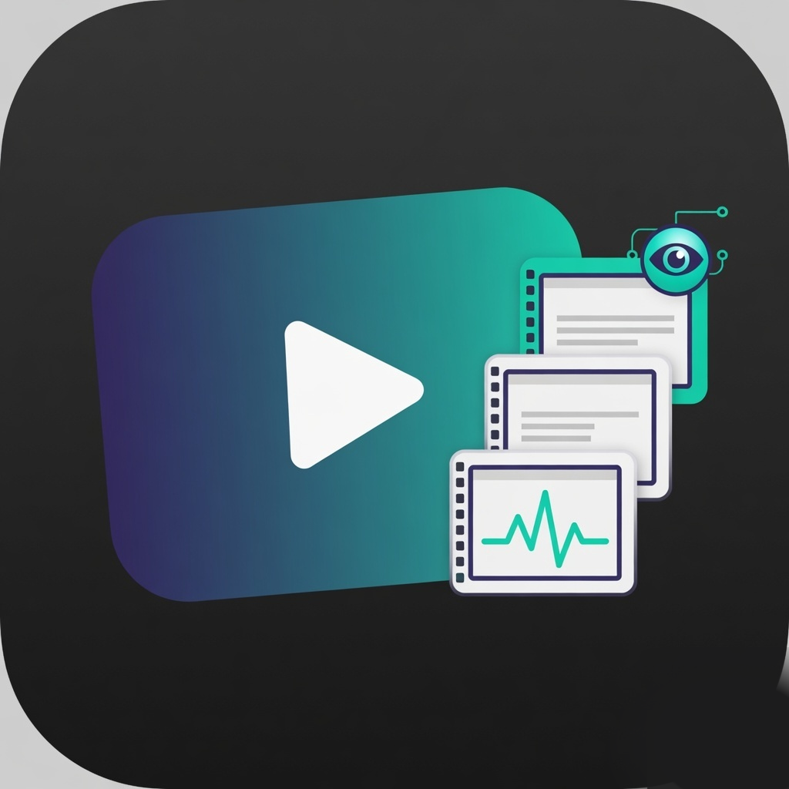

# AgentVideoParse

<p align="center">
  
</p>

**Local, fully open-source** desktop helper for **macOS, Windows, and Linux**: drop a **short debug video (max 30 seconds)** and get an **ordered folder of frame screenshots** for AI/coding agents.

> Agents read still images well but struggle to “watch” video. AgentVideoParse turns a **≤30s** clip into a small set of ordered stills. Longer videos are **rejected** (nothing is extracted).

**Logo / app icon:** [`assets/logo.png`](assets/logo.png) (1024×1024 primary), also [`assets/icon.png`](assets/icon.png), [`assets/logo-512.png`](assets/logo-512.png), [`assets/logo-256.png`](assets/logo-256.png).

See [PROJECT-BASIS.md](PROJECT-BASIS.md) for product origin and [IMPLEMENTATION-PLAN.md](IMPLEMENTATION-PLAN.md) for architecture.

---

## Debug logging (all GUIs)

Every platform GUI has **Debug logging**:

1. Turn on **Debug logging**
2. Run an export (or reproduce a failure)
3. Use **Open debug log** / **Copy log path** to extract the text log

Logs go under (local only, never uploaded):

| OS | Default log folder |
|----|--------------------|
| macOS | `~/Movies/AgentVideoParse/logs/` |
| Windows | `%USERPROFILE%\Videos\AgentVideoParse\logs\` |
| Linux | `~/Videos/AgentVideoParse/logs/` |

CLI: `AVP_DEBUG=1` or `AVP_DEBUG_LOG=/path/to/file.log python3 -m avp export …`

---

## Downloads (GitHub Releases)

Three separate releases — pick your OS:

| OS | Release | What’s inside |
|----|---------|----------------|
| **macOS** (Apple Silicon) | [v1.0.0-macos](https://github.com/IronAdamant/AgentVideoParse/releases/tag/v1.0.0-macos) | Double-click **AgentVideoParse.app** (no Python) |
| **Windows** | [v1.0.0-windows](https://github.com/IronAdamant/AgentVideoParse/releases/tag/v1.0.0-windows) | Unzip → **AgentVideoParse.bat** (needs Python 3 once) |
| **Linux** | [v1.0.0-linux](https://github.com/IronAdamant/AgentVideoParse/releases/tag/v1.0.0-linux) | Unzip → `./AgentVideoParse` (needs python3-tk + GStreamer) |

All releases: [github.com/IronAdamant/AgentVideoParse/releases](https://github.com/IronAdamant/AgentVideoParse/releases)

---

## For non-technical users (recommended)

**→ Read [START-HERE.md](START-HERE.md)** — plain-language install + double-click instructions.

### macOS app (recommended on Mac — no Python)

```bash
./scripts/build-macos-app.sh   # once after clone (needs Xcode CLT)
open dist/AgentVideoParse.app  # or double-click in Finder
```

Drag **`dist/AgentVideoParse.app`** to **Applications** if you like. First open: right-click → **Open** if Gatekeeper blocks it.

Then: choose a video **≤ 30 seconds** → **Reveal in Finder** for the screenshots folder.

### Other platforms (Python GUI for now)

1. Install [Python 3](https://www.python.org/downloads/) (Windows: tick **Add to PATH**).
2. Double-click **`AgentVideoParse.bat`** (Windows) or run **`./AgentVideoParse`** (Linux + `python3-tk` / GStreamer).

---

## Run (technical / CLI)

| OS | App / double-click | CLI |
|----|--------------------|-----|
| **macOS** | `dist/AgentVideoParse.app` | `dist/AgentVideoParse.app/Contents/MacOS/AgentVideoParse export clip.mp4` |
| **Windows** | `AgentVideoParse.bat` | `bin\windows\run.bat` |
| **Linux** | `./AgentVideoParse` | `./bin/linux/run` |

```bash
./scripts/build-macos-app.sh
open dist/AgentVideoParse.app
# CLI through the app binary:
dist/AgentVideoParse.app/Contents/MacOS/AgentVideoParse export fixtures/short-2s.mp4
```

Mac app: **SwiftUI + AVFoundation** only (no Python). Other OS: Python 3 + tkinter + system media stacks.

---

## Fully open source

This project is released under the **MIT License** — see [LICENSE](LICENSE).  
It runs **only on your computer**. It does **not** upload your video.

---

## Platforms

| OS | Media stack (system only) | GUI |
|----|---------------------------|-----|
| **macOS** | AVFoundation + ImageIO | SwiftUI app (`ui/macos`) and/or portable tkinter GUI |
| **Windows** | WPF **MediaPlayer** (inbox) + WIC PNG encode via `AvpExtract.cs` | WPF (`ui/windows`) and/or tkinter |
| **Linux** | GStreamer 1.x via `avp_gst` (seek-accurate) or **python3-gi** fallback | tkinter (`ui/linux/app.py`) |

---

## Hard limit: 30 seconds

- Videos **longer than 30.0 seconds are rejected**.
- **No partial processing** (we do **not** extract only the first 30 seconds).
- Reason: longer clips produce too many images and overwhelm agent debug sessions.

Default sampling: **2 frames per second**, hard max **60** stills.

---

## Debugging tool only

AgentVideoParse is for **debugging / AI agent UI review only**.

**Do not** use it as:

- a general video editor  
- an archival or production media converter  
- a long-form video analysis suite  

---

## Zero third-party application dependencies

Product code uses:

- **Python 3 standard library** for shared core (duration gate, sampler, manifest, export orchestration)
- **OS / distro system frameworks only** for decode and native UI  
  - macOS: AVFoundation, SwiftUI  
  - Windows: Media Foundation / WPF (inbox), no NuGet `PackageReference`  
  - Linux: GStreamer system packages (not vendored in this repo)

**Not used:** vendored FFmpeg, npm/pip/cargo product packages, Electron, Qt-via-packages, analytics SDKs.

Dependency gate:

```bash
sh scripts/check-no-third-party-deps.sh
# Windows: powershell -File scripts/check-no-third-party-deps.ps1
```

---

## Disclaimer

```
DISCLAIMER

• Your video file must be 30 seconds or shorter. Longer files are rejected; no frames are extracted.
• AgentVideoParse is a debugging tool for AI/agent UI review only. Do not use it as a general video editor or archival converter.
• This software is fully open source and runs locally on your computer (macOS, Windows, or Linux). It does not upload your video.
```

The same text appears as a **permanent banner** in each platform GUI.

---

## What it does

1. You drop or choose a short `.mov` / `.mp4` (or similar).  
2. The app probes duration with the **system** media stack.  
3. If duration **> 30s** → clear error, **zero** frame files.  
4. If OK → writes ordered `frame-0001.png` … plus `MANIFEST.txt` and `README-FOR-AGENT.txt`.

Default output roots:

| OS | Path |
|----|------|
| macOS | `~/Movies/AgentVideoParse/` |
| Windows | `%USERPROFILE%\Videos\AgentVideoParse\` |
| Linux | `~/Videos/AgentVideoParse/` (or `~/AgentVideoParse/`) |

---

## Build & run

### Shared core tests (any OS with Python 3)

```bash
cd /path/to/AgentVideoParse
PYTHONPATH=shared/core:. python3 -m unittest shared.core.tests.test_core -v
# or:
PYTHONPATH=shared/core:. python3 shared/core/tests/test_core.py -v
```

### CLI export (uses host OS backend)

```bash
export PYTHONPATH="shared/core:."
python3 -m avp export /path/to/short.mp4
python3 -m avp disclaimer
```

### macOS

1. **Backend helper** (auto-built on first use via `swiftc` + AVFoundation).  
2. **Portable GUI** (tkinter):

```bash
PYTHONPATH=shared/core:. python3 ui/linux/app.py
```

3. **Native SwiftUI** sources: `ui/macos/AgentVideoParseApp.swift` (system frameworks only; shells out to the same Python export path).

### Windows

1. Build `backends/windows/AvpExtract.cs` with `csc` (no NuGet) — see comments in the file.  
2. Open `ui/windows/AgentVideoParse.csproj` in Visual Studio **or** run the portable GUI:

```bat
set PYTHONPATH=shared\core;.
python -m avp export short.mp4
python ui\linux\app.py
```

Requires Windows 10/11 with Media Foundation (standard).

### Linux

Install **system** packages (example Ubuntu/Debian):

```bash
sudo apt install python3 python3-tk \
  gstreamer1.0-tools gstreamer1.0-plugins-base \
  gstreamer1.0-plugins-good gstreamer1.0-libav
```

Optional C helper:

```bash
cc -O2 -o backends/linux/avp_gst backends/linux/avp_gst.c \
  $(pkg-config --cflags --libs gstreamer-1.0 gstreamer-pbutils-1.0)
```

```bash
PYTHONPATH=shared/core:. python3 ui/linux/app.py
```

---

## Output layout

```
frame-0001.png
frame-0002.png
...
MANIFEST.txt          # index → timestamp → filename
README-FOR-AGENT.txt  # debug-only purpose note
```

---

## Repository layout

```
shared/core/avp/     # shipped pure core + export orchestrator
backends/macos|windows|linux/
ui/macos|windows|linux/
scripts/check-no-third-party-deps.*
fixtures/            # generated short/long test videos (optional)
```

---

## License

MIT — [LICENSE](LICENSE).
